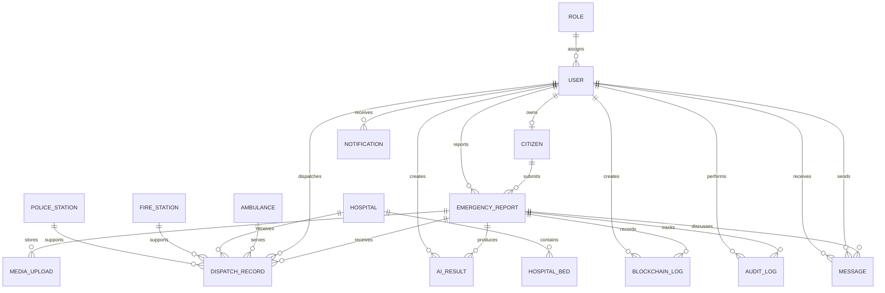

# Entity Relationship Diagram

```mermaid
erDiagram
  ROLE ||--o{ USER : assigns
  USER ||--o| CITIZEN : owns
  CITIZEN ||--o{ EMERGENCY_REPORT : submits
  USER ||--o{ EMERGENCY_REPORT : reports
  EMERGENCY_REPORT ||--o{ DISPATCH_RECORD : receives
  USER ||--o{ DISPATCH_RECORD : dispatches
  AMBULANCE ||--o{ DISPATCH_RECORD : serves
  HOSPITAL ||--o{ DISPATCH_RECORD : receives
  FIRE_STATION ||--o{ DISPATCH_RECORD : supports
  POLICE_STATION ||--o{ DISPATCH_RECORD : supports
  HOSPITAL ||--o{ HOSPITAL_BED : contains
  EMERGENCY_REPORT ||--o{ AI_RESULT : produces
  EMERGENCY_REPORT ||--o{ BLOCKCHAIN_LOG : records
  EMERGENCY_REPORT ||--o{ AUDIT_LOG : tracks
  EMERGENCY_REPORT ||--o{ MESSAGE : discusses
  EMERGENCY_REPORT ||--o{ MEDIA_UPLOAD : stores
  USER ||--o{ NOTIFICATION : receives
  USER ||--o{ MESSAGE : sends
  USER ||--o{ MESSAGE : receives
  USER ||--o{ AI_RESULT : creates
  USER ||--o{ BLOCKCHAIN_LOG : creates
  USER ||--o{ AUDIT_LOG : performs
```
